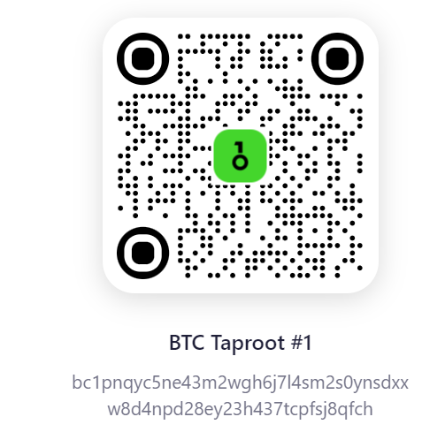
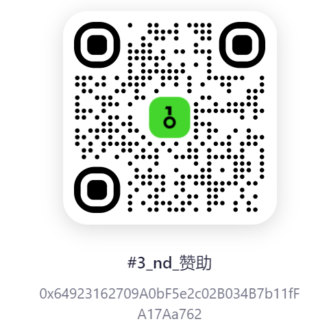

    nodelta-System 是一套基于Python的Crpyto市场开源量化交易框架，0xBillJin是本框架的贡献者。

# 功能：

1. 基于事件驱动的架构设计，对于不同的exchange，本框架构造了一致性的交易接口，对于OrderData、TradeData、PositionData、DepthData、BarData等市场数据类型实现了一致性封装。

2. 涵盖多个Exchange的交易接口(gateway)：

    * BinanceUmGateway：binance U本位永续合约接口

    * okx_gateway：OKX 现货、杠杆、合约接口

3. 策略进程、进程组管理：

    * 基于poetry的策略进程与进程组管理

4. 服务器硬件监控：

    * 实时监控Linux服务器的CPU、内存、磁盘资源使用情况；资源紧张时发出预警

5. 消息通知模块：

    * lark & wechat 消息推送

6. 回测模块：

    * backtest_cta_gateway同一份strategy.py 策略脚本实盘与回测通用

# 使用说明：

    由于开发时间紧张，具体的使用案例可前往 example 文件夹查看使用案例。更详细的使用文档将会在未来更新。

# V2 版本 to do

    1. 异步重构gateway

    2. 接入链上AMM & order book 类型的DEX交易市场

    3. EVM智能合约交互接口

    4. 基于OPEN AI API 的智能策略投研平台

# 欢迎赞助：

    欢迎赞助开发者（0xBillJin），你们的认可是我前进的动力。

    BTC 地址： bc1pnqyc5ne43m2wgh6j7l4sm2s0ynsdxxw8d4npd28ey23h437tcpfsj8qfch
    

    EVM 链（ETH、BSC、Polygon、ARB、OP）地址： 0x64923162709A0bF5e2c02B034B7b11fFA17Aa762
    

# 欢迎注册：

    本框架接入了BINANCE & OKX 交易所；欢迎我的邀请链接注册：

    * 币安 BINANCE：
        https://accounts.binance.com/register?ref=JJIXVSW1
